```{r setup, include=FALSE}
knitr::opts_chunk$set(echo = TRUE)
```


```{r, echo=FALSE,fig.height=4, fig.width=6.5}
library(gridExtra)
library(ggplot2)
library(png)

# Load the images into two plots
csu_logo <- grid::rasterGrob(png::readPNG("graphs/Images for paper/csu-logo.png"),
                             interpolate = TRUE)
nfl_logo <- grid::rasterGrob(png::readPNG("graphs/Images for paper/nfl-logo.png"),
                             interpolate = TRUE)

# Combine the two images side by side
grid.arrange(
  gridExtra::arrangeGrob(csu_logo, nfl_logo, ncol = 2),
  ncol = 1
)
```
\newpage


# Contents:

  1. Overview/ Introduction
  2. Description of Data Sets
  3. Exploratory Data Analysis
  4. Variables and Data Cleaning
  5. Model Selection
  6. Model Evaluation Metrics
  7. Results- Logistic Regression
  8. Results- Linear Support Vector Machine
  9. Results- Random Forrest
  10. Model Comparison
  11. Conclusion
  12. Discussion and Future Research
  13. Citations


  
## 1. Overview/ Introduction:

For our project we decided to participate in the National Football League's Big Data Bowl competition for 2025. The purpose of this competition is to use player and team behavior right before the play begins to gain insight into the resulting play. We realized that the most important information a defense can have is whether the offense intends to execute a run or pass play. Knowing this information would allow the defensive team to move their players around to optimize their chances of getting a tackle or otherwise disrupting the play. We therefore decided to develop statistical models that can predict what kind of play the offense will execute based on game characteristics, team characteristics, and player behavior before and during the snap which we will explore in greater detail later on. 
  
  
## 2. Data Sets:

  The NFL provided several useful data sets for us to draw from for our analysis.
  
-**games.csv**: This set contains all of the game data for the first 9 weeks of the 2022 season.

-**plays.csv**: This set contains all of the play by play data.

-**players.csv**: This set contains all of the individual performance data for NFL players.

-**player_play.csv**: This set contains all of the player level stats for each game and play.

-**tracking_week_[week].csv**: This set contains all of the tracking data for players and the ball for each game and play in a given week.


\newpage 

## 3. Exploratory Data Analysis:

  Since we were interested to see if things like player motion before or during the snap could be useful in predicting the play type we decided to look at a week of tracking data which contains key pre-snap events like when the offensive line is set (line_set), when the ball is snapped (ball_snap), and whether or not a player was in motion before the snap (man_in_motion) and plot the frequency of these events.
  
```{r echo=FALSE}
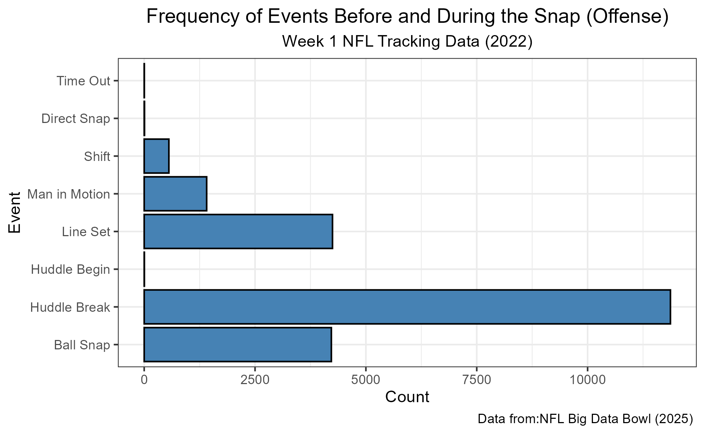
```
\newpage

  We were also interested to know if there would be any imbalance in our data (i.e. differing numbers of pass and run plays). To determine this we created indicator variables that classified any play with a dropback type of DESIGNED_RUN, and QB_SNEAK as a run play and any plays with a dropback type of TRADITIONAL, SCRAMBLE, or some form of ROLLOUT as pass plays. We then plotted the frequency of each type to visualize any imbalance.
  
```{r, echo=FALSE}
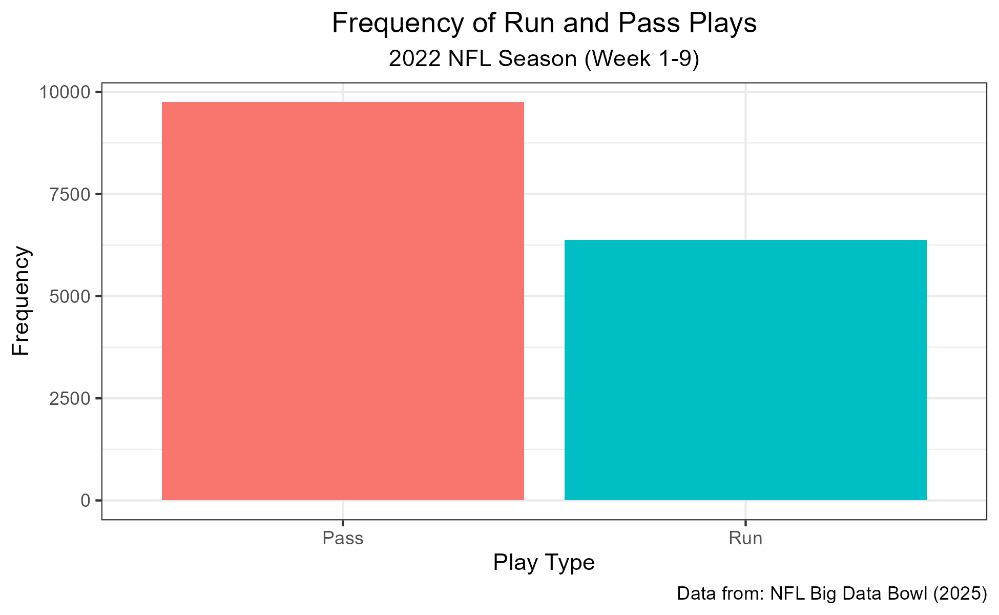
```


Digging deeper, we can observe these trends on a team-by-team basis. We found that most NFL teams pass more than they run. However, four teams deviate from this pattern, running more than they pass. Even in these cases, the difference between run and pass plays is not as drastic as it is for pass-heavy teams.

```{r, echo = FALSE}
# # Load the images into two plots
# AFCprop <- grid::rasterGrob(png::readPNG("graphs/Images for paper/final_AFC_prop.png"),
#                              interpolate = TRUE)
# NFCprop <- grid::rasterGrob(png::readPNG("graphs/Images for paper/final_NFC_prop.png"),
#                              interpolate = TRUE)
# 
# # Combine the two images side by side
# grid.arrange(
#   gridExtra::arrangeGrob(AFCprop, NFCprop, nrow = 2),
#   ncol = 1
# )
```
```{r, echo =FALSE}
knitr::include_graphics("graphs/Images for paper/final_AFC_prop.png")
knitr::include_graphics("graphs/Images for paper/final_NFC_prop.png")
```


## 4. Variables and Data Cleaning:

  Using our background knowledge and drawing on our EDA we decided to include the following variables in our models.
  
  
  **_Game Characteristics:_**

- **`game_id`**: Unique identifier for the game
- **`play_id`**: Unique identifier for a specific play
- **`possession_team`**: Identifies the offensive team
- **`week`**: Identifies which week of the season the game was in
- **`run_pass`**: Indicates if the play was a run or a pass (response variable)
- **`down`**: Identifies which down the offensive team was on for a particular play
- **`yards_to_go`**: The number of yards needed to get a first down
- **`yards_to_endzone`**: The number of yards to the opponent's endzone
- **`redzone`**: Indicates whether the offense is within 20 yards of the opponent's endzone
- **`sec_in_half`**: The number of seconds remaining on the play clock in the current half
- **`epa_lag`**: Serial correlation of expected points added

\newpage

Many of these were generated by the NFL but some of them were made by us using their provided data set. The run_pass indicator we used as our response was a classification made by us within the data as they did not provide a strict column for run or pass. The epa_lag variable was also generated using the provided expectedPointsAdded column. The lag is done on a per drive basis and every new drive of an offense starts at epa_lag = 0. We felt the indication of previous play success (positive epa) would be a significant contributor to the prediction models.

**_Team Characteristics:_**

- **`offense_formation`**: Categorical variable indicating what formation the offense uses
- **`receiver_alignment`**: Enumerated as 0x0, 1x0, 1x1, 2x0, 2x1, 2x2, 3x0, 3x1, 3x2 (text)
- **`curr_win_percentage`**: Win percentage for the current offensive team
- **`form_change`**: Uses shifts to determine if the offense changed formation before the ball was snapped

These variables all came from the provided data set. These were some characteristics we felt would positively contribute to the prediction models as they relate to overall team by team trends. We knew the models would be broken up by team as each team has their own offensive philosophies and as such these would show those tendencies.

<!-- I'm not sure why the spacing for this last section isn't consistent with the first two -->
<!-- come back later to fix -->
**_Player Characteristics:_**

- **`wr_motion`**: Indicates if a wide receiver moved after the line was set
- **`te_motion`**: Indicates if a tight end moved after the line was set
- **`rb_motion`**: Indicates if a running back moved after the line was set
- **`wr_atsnap`**: Indicates if a wide receiver was in motion at the time of the snap
- **`te_atsnap`**: Indicates if a tight end was in motion at the time of the snap
- **`rb_atsnap`**: Indicates if a running back was in motion at the time of the snap

These are the variables incorporating the player tracking data. Initially we were trying to condense the large week by week tracking csv's in order to get these important predictors. However, we found that the NFL actually provided a condensed version of those tracking files to us, and we were able to generate each position a boolean of presnap motion and at snap motion. We wanted to keep the feature space on these more generic as a specific wide receiver motion or "left to right" indicators would introduce more noise in an already quite large predictor space.


## 5. Model Selection:

  We were interested in predicting the type of play the offense will execute. We had a large number of predictors and the predictor space was further increased by our addition of several indicator variables for player motion. We therefore selected models that are good for binary classification and those that can handle larger predictor spaces without taking an excessive amount of time to run. We additionally wanted to try a non-parametric approach for comparison. These considerations lead us to choose the following models.
  
**Logistic Regression (LASSO):**

  First we wanted to create a basic logistic regression model as "control" that we could compare our other more sophisticated models against. To accomplish this we used LASSO with 10-fold cross validation on the entire data set to perform variable selection. Once the optimal lambda value had been determined and the optimal LASSO model fit we look at the output to determine which of our variables to include in the logistic regression model. We then fit the logistic regression model on the entire data set in an attempt to identify any and all errors that would occurr later on when we tried to fit models for each team individually. Once this was complete we then fit a logistic regression model for each NFL team
  
\newpage
  
**Linear Support Vector Machine (SVM):**

<!-- I think you could summarize our reasoning for this one better Chandler -->
For the SVM Model we knew that the binary classification power would work well for our research question. There was a fairly high predictor space that we just left as and see if it could tackle them all before reduction would be required. This did take a while in practice and the k-fold cross validation had to be reduced from 10 folds to just 5 folds. Even with this reduction in k-folds the model still took quite a while to complete the training for all 32 teams. However as discussed later the prediction power of this method was retained and produced quite favorable results.

**Random Forest:**

A tree based model, such as a Random Forest, appeared to be a good method for predicting NFL play outcomes given its nonparametric nature. The game of football is very complex with many intricate trends that may be difficult to recognize. Taking into account the many game settings presented in a NFL game, along with the trends and intricacies of a complex NFL offense, this model may be able to distinguish between a potential run or pass.

For testing this method, a model was fit on each NFL team using 7-fold cross-validation to find the optimal parameters. Given our data set included the first nine weeks of the NFL season, the primarily assessed model was trained on the teams first 5-6 games(5 if a team had a bye week in the early parts of the season) and tested on the final 3 games of this period. 

When training the models, the proportion at which a team runs and passes was considered. To account for a potential minority class, we calculated the ratio between the number of cases in the majority class with the number of cases in the minority class. This value was the weight value assigned to the minority class. By weighting the minority class, we were able to assign greater importance to this class when training. Without this, we may notice greater imbalances in the model's ability to predict the minority class. The problem we are attempting to answer relies on this, as predicting a pass or run is equally as important.

**KNN:**

KNN was a non-parametric approach to the research question we tried. KNN can prove quite powerful when there is little overlap in the response compared to the feature space, which was our hope. However that did not prove to be the case and we ended abandoning this model all together. Part of the problem for KNN is the number of observations compared to the dimensionality of the problem. Predicting run or pass is a complicated endeavor and NFL offenses only get around 60 plays a game. Even when attempting to run on all 8-9 games for a team, that is only 540 games, or so, per team to train on. The model would run for some but failed to execute the prediction step for approximately half of the teams. We tried to make adjustments to the model to get predictions for every team but it was apparent KNN was not going to be a tool that we could use to describe the outcome effectively and so we decided to move on from this approach all together.

## 6. Model Evaluation:

  To evaluate our models performance we decided to employ Matthews Correlation Coefficient (MCC). MCC which can be understood as the correlation coefficient between predicted and actual classifications can be expressed mathematically as follows:
  

$$
\text{MCC} = \frac{TP \times TN - FP \times FN}{\sqrt{(TP + FP)(TP + FN)(TN + FP)(TN + FN)}}
$$
  Here an MCC score of 1 indicates perfect agreement between predicted classes and actual classes, a score of -1 indicates complete disagreement between predicted and actual classes, and a score of 0 indicates that the predictions are no better than randomly guessing the class.
  
  We can see that the numerator rewards true positives and true negatives while penalizing false positives and false negatives. The deonominator ensures that MCC scores are normalized between -1 to 1. 
  
  We chose to utilize MCC for several reasons. First, MCC is good at handling imbalanced data, which would be useful considering that pass plays are meaningfully more frequent than run plays. Second, it is comprehensive, considering all elements of the confusion matrices. Finally, we chose MCC because unlike precision and accuracy, MCC is unbiased. 


## 7. Results- Logistic Regression (LASSO):

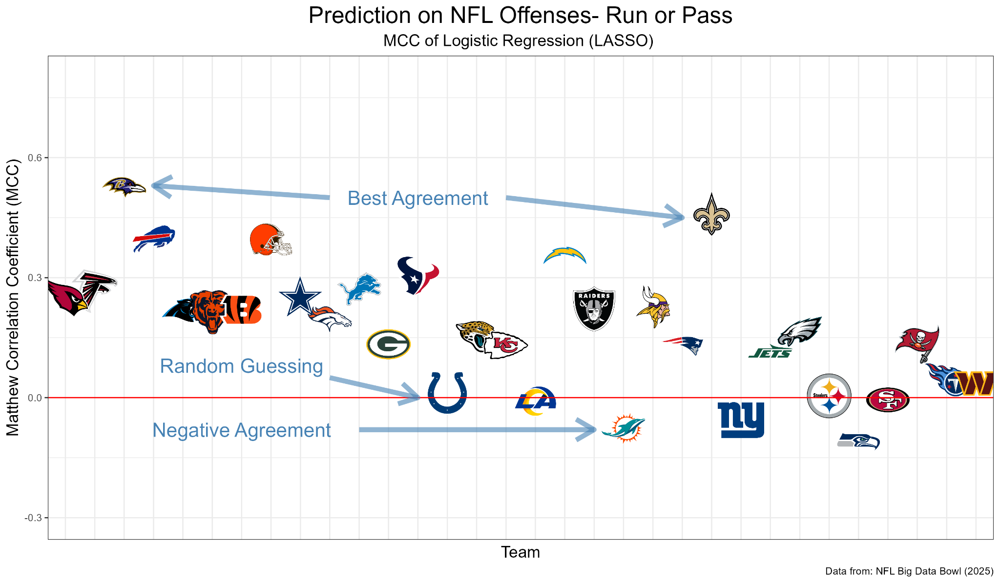{width="100%"}


  In the above figure we can see the value of Matthews Correlation Coefficient for each teams logistic regression model. It is clear that most of the models showed modest levels of positive agreement between predictions and reality with the best agreement of $ 0.53$ occurring in the Baltimore Ravens model (top left), and the second best of $0.46$ for the New Orleans Saints. 
  
  There were also several models with MCC scores of $\approx 0$. These teams include the Indianapolis Colts, Los Angeles Rams, Pittsburgh Steelers, and the San Francisco 49'ers. The MCC score for these models indicate that their predictions for run or pass were no better than random guessing. 
  
  <!-- Do we have some good explanation as to why the logistic model was so much wrose? -->
  
  Finally we can see that three of the models had negative MCC scores, namely the Miami Dolphins, The New York Giants, and the Seattle Seahawks. These MCC scores indicate that the models performed even worse than random guessing. 
  
  I have been unable to determine how this happened but I may have made an error in the logistic model. When I tried to put all of my code for the logistic model into one file the resulting plot is different from the one shown above. I cannot say what happened at this stage but I will include the new version of the plot for comparison.
  

```{r, echo=FALSE}
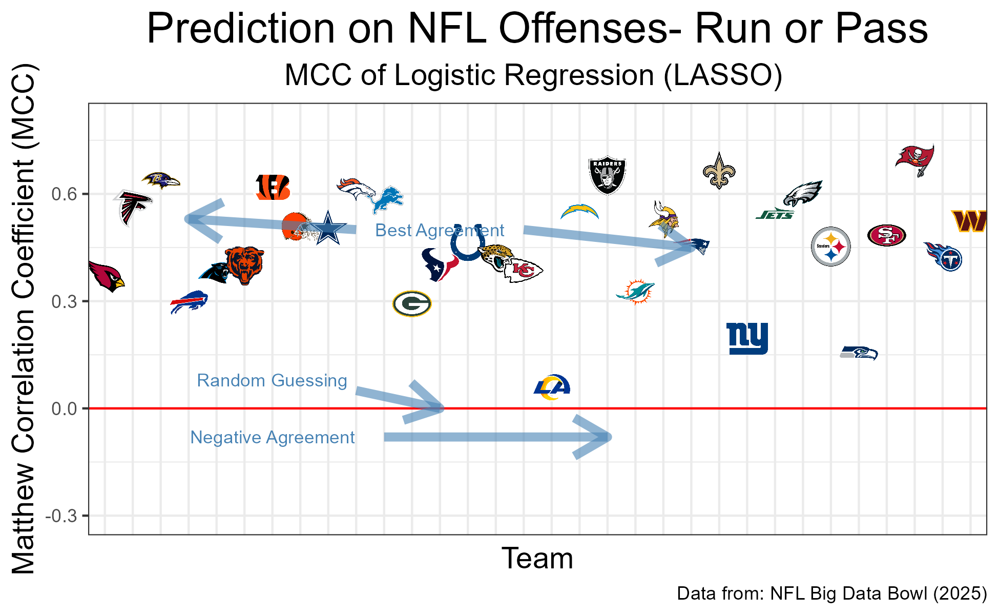
```

  


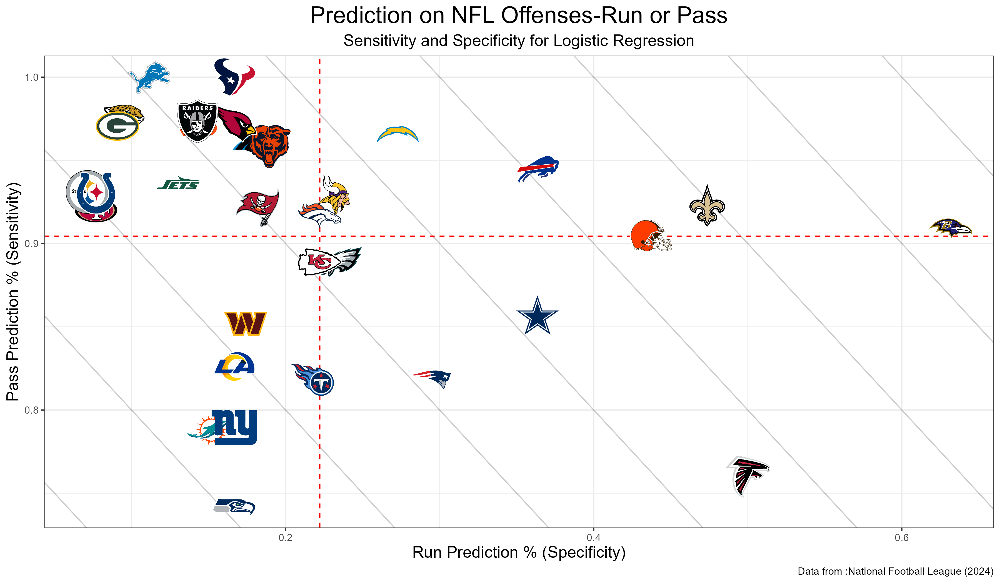{width="100%"}

  The above plot shows sensitivity (True Positive Rate) vs. specificity (True Negative rate) for each teams logistic regression model. The dotted red lines represent the mean sensitivity ($\approx 0.905$) and specificity ($\approx 0.23$) respectively. These means that the models were generally biased towards predicting passes, which is consistent with our earlier findings that pass plays are more common than run plays. The largest cluster of teams are located in the upper left quadrant where teams had above-average predictability for passing and below-average predictability for running. In the bottom left quadrant we there appears to be a lower bound on predictability for running. There appears to be much wider variation among teams with above average predictability for runs shown by the lesser amount of clustering on the right side of the graph. 
  
  As mentioned above when trying to put all of the code for the logistic model in a single file numeric discrepancies arose that greatly alter the resulting plots. I have not been able to determine the cause but I will again include the updated graph for comparison.
  
```{r, echo=FALSE}
knitr::include_graphics("graphs/Images for paper/Sens_vs_Spec_log.png")
```
  


## 8. Results- Linear SVM:

```{r, echo=FALSE}
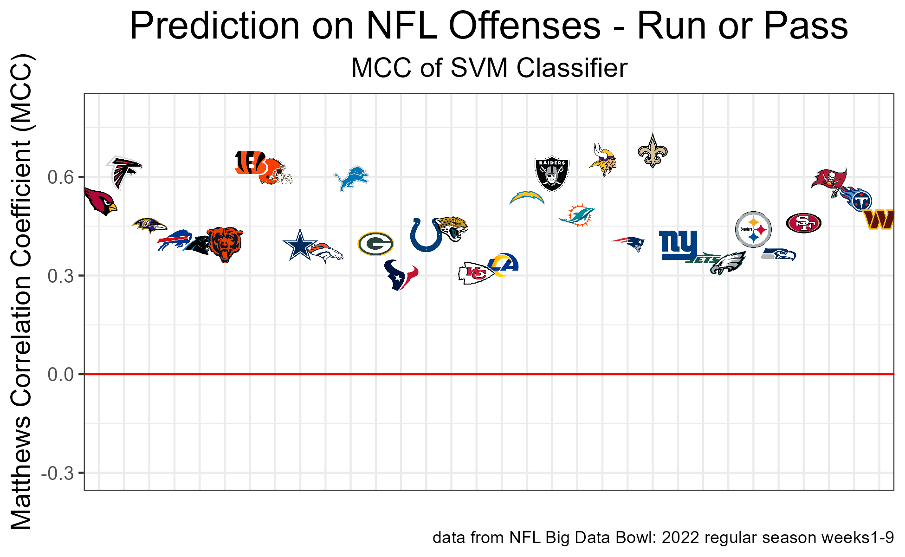
```

SVM performed well in terms of classification using the MCC. In the MCC plot for each team we see a band around 0.3 to 0.7 that each team lives in. Some are higher than others but all of them are above 0 indicating the SVM model performed quite well at predicting run or pass. 

\newpage

```{r, echo=FALSE}
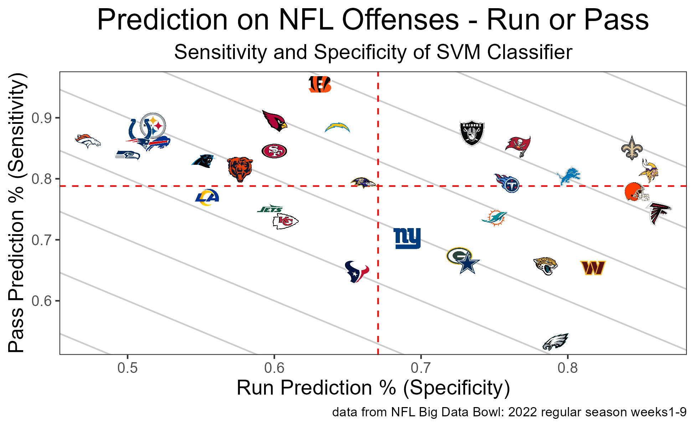
```

When we look at the breakdown between run and pass predictions in the Sensitivity vs Specificity plot, we can see a similar level of predictability for each team. As mentioned each team has a different proportion of run and pass plays, and this will influence the predictability. However, there is a line to the bottom left of the plot that no team falls below in. Almost a predictability minimum for the SVM model indicating a high level of performance, even for the teams lower in performance. 


## 9. Results- Random Forest:


Preliminary model assessment included analyzing the best parameters for each team to determine similarities and differences. I found that each team varied widely in the optimal tuning parameters. For example, the Los Angeles Chargers model had a mtry of 5 and a min.node.size of 1 while the Los Angeles Rams had mtry of 9 and min.node.size of 30. Though the best tunes varied, I was surprised to see many teams with min.node.size’s of 1. This would indicate that deep trees were grown, potentially overfitting. However, considering teams may have only been trained on a couple hundred plays, this makes sense.

```{r, echo=FALSE}
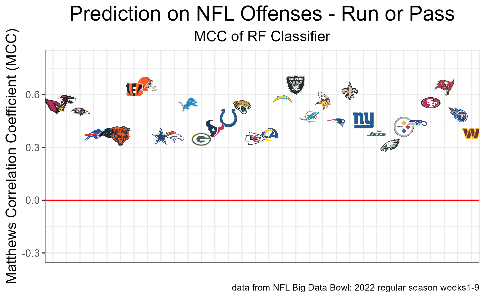
```

As stated prior, to be able to compare model performance across models we used Matthew’s Correlation Coefficient(MCC). The performance of the random forest model was very similar to the SVM model in terms of MCC. All values for teams were above the value of 0.3, meaning that the observed data and the predicted data positively agree.

```{r, echo=FALSE}
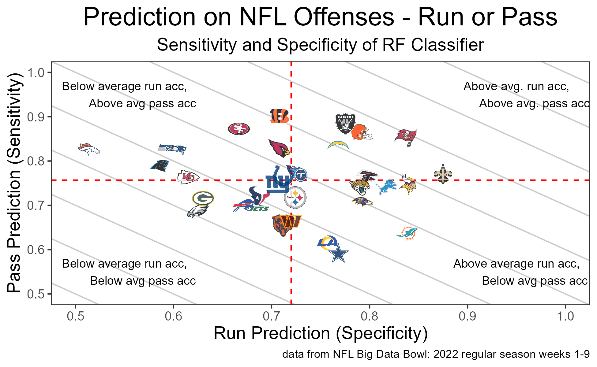
```

The random forest model provided promising results. When comparing teams’ test run play accuracy(specificity) and pass play accuracy(sensitivity), we find that all values are above 0.5, proving we can accurately predict much better than just a coin flip. We see in the graph that there are not many outlier teams, with the teams forming a circle around the means. This is encouraging to see that model performance doesn’t differ notably from team to team. Overall, the predictions were quite accurate.

```{r, echo=FALSE}
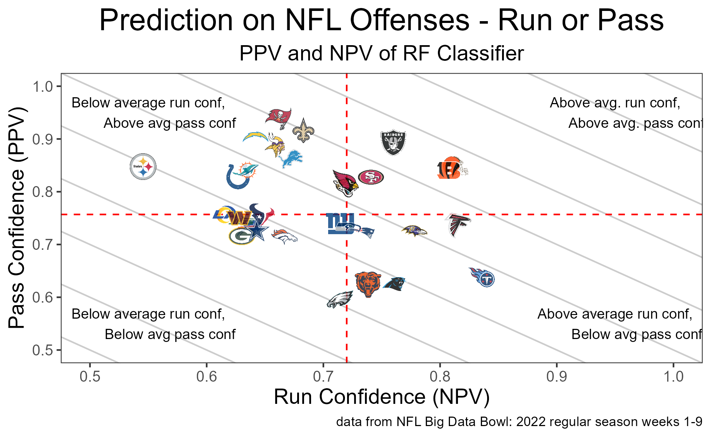
```


We can also see how confident we are in our predictions by evaluating the passing predictive value(positive) and running predictive value(negative). These values will tell us when we predict a certain class, how certain we are in that predicted class.

Looking at the graph there are some interesting trends to pull from. We notice that the team with the highest pass predictive value of 0.94, the Tampa Bay Buccaneers, also had one of the highest pass play rates in the league. With this, they have a below average run play predictive value of 0.66, which is still a reasonable level of confidence. We can also see that the four teams that ran more than passed(Tennessee Titans, Atlanta Falcons, Philadelphia Eagles, Chicago Bears) are all located in the bottom right quadrant. This quadrant represents above average run play confidence and below average pass play confidence.


```{r, echo=FALSE}
# # Load the images into two plots
# CLEvarimp <- grid::rasterGrob(png::readPNG("graphs/Images for paper/final_CLEvar.png"),
#                              interpolate = TRUE)
# PHIvarimp <- grid::rasterGrob(png::readPNG("graphs/Images for paper/final_PHIvar.png"),
#                              interpolate = TRUE)
# 
# # Combine the two images side by side
# grid.arrange(
#   gridExtra::arrangeGrob(CLEvarimp, PHIvarimp, nrow = 2),
#   ncol = 1
# )

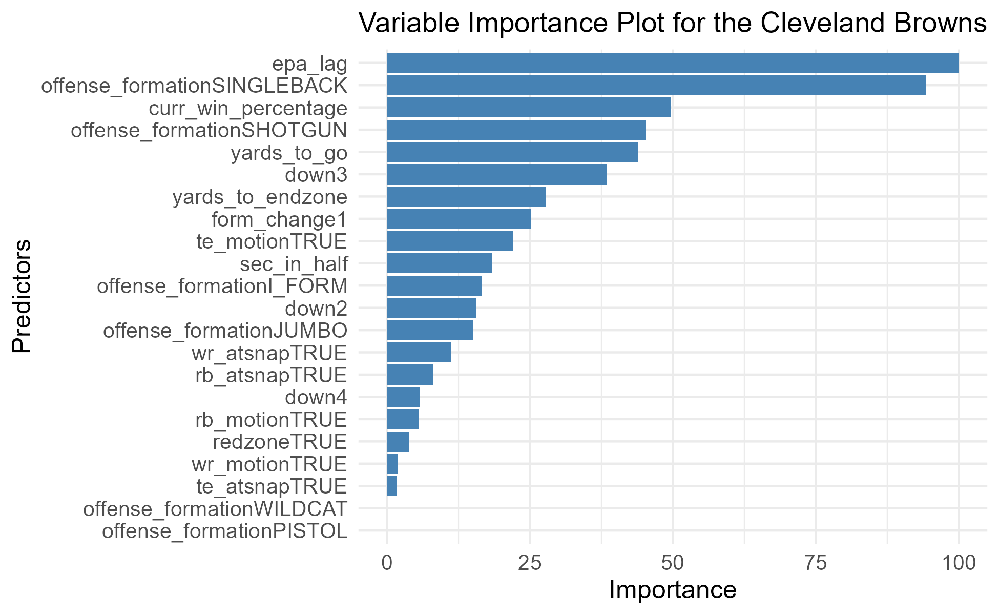
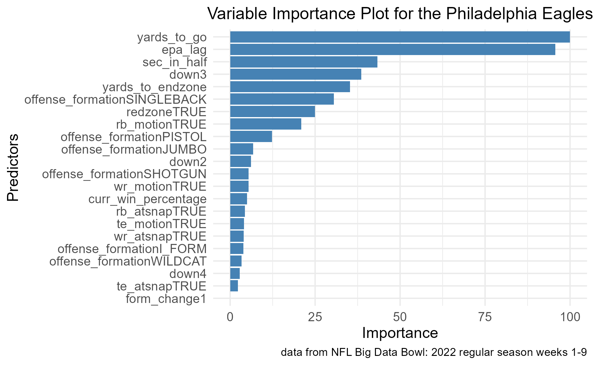

```


Given there are individual models for each team, the variable importance across models may be drastically different. All teams have different game plans which involve different formations, motions, prioritize running or passing, and may react differently to different game settings. To appreciate this we looked at the best and worst teams in regard to their MCC values. These two teams are the Cleveland Browns with an MCC of 0.66 and the Philadelphia Eagles with an MCC of 0.31. It is interesting to see that both teams had epa lag(the measure of success of the previous play) as one of the most important predictors. For the Browns, it appears the model found formations that may signal whether they pass or run. For the Eagles, it appears the model found trends in different game settings(time left, yards to go, etc.) when determining to pass or run. 


## 10. Model Comparison:

```{r, echo=FALSE}
# Load the images into two plots
AFC_table <- grid::rasterGrob(png::readPNG("graphs/Images for paper/AFC Table - Full.png"),
                             interpolate = TRUE)
NFC_table <- grid::rasterGrob(png::readPNG("graphs/Images for paper/NFC Table - Full.png"),
                             interpolate = TRUE)

# Combine the two images side by side
grid.arrange(
  gridExtra::arrangeGrob(AFC_table, NFC_table, ncol = 2),
  ncol = 1
)
```

The above tables show the MCC values associated with each of our models by team. Here the models with the highest (best) MCC scores are colored in green while the lowest (worst) are colored in red. We can see that the logistic regression model performed poorly compared to the Random Forest and SVM with consistently lower MCC scores. The logistic model had the highest MCC score only once for the Baltimore Ravens team.

The performance of the random forest and SVM models were much more comparable with each having similar numbers of optimal MCC values. The SVM model was the optimal model for 16 of the 32 teams with most scores between 0.3 and 0.6. The random forest model was the optimal model for 15 of the 32 teams with most scores between 0.3 and 0.7. These findings suggest that the random forest and SVM models are equally likely to be the best choice, while the logistic regression model does not measure up.


## 11. Conclusion:


## 12. Discussion and Future Research

Currently, the predictions obtained from our models are so far good. However, we believe there are tings that could be improved upon and explored. Though many of the pre-play variables from the offenses perspective have been covered, we neglected to consider the quality of our opponent. That being said, there may be some opponent defensive performance metrics that may be included in the model. For example, if we included the ability of the opponents run and pass defense, that may give signal to if the offense is better off running versus passing.

Other than including more predictors, we may also try different modeling techniques. Specifically, we have considered evaluating different kernels in our SVM models. Currently, we only evaluated the linear kernel which has shown to be successful. However, the response we are trying to predict may perform better with a more flexible decision boundary such as the radial or polynomial kernel.

Separate from out offensive model, we would like to apply similar methodologies to the defensive side of the ball. We could very easily apply the same predictors we have(and more specific to the defensive perspective) to predict whether a team will play zone coverage, man coverage, blitz and more. This problem would introduce more response classes and create a potentially more difficult problem.


## 13. Citations:

Michael Lopez, Thompson Bliss, Ally Blake, Paul Mooney, and Addison Howard. NFL Big Data Bowl 2025. https://kaggle.com/competitions/nfl-big-data-bowl-2025, 2024. Kaggle.

H. Wickham. ggplot2: Elegant Graphics for Data Analysis. Springer-Verlag New York, 2016.
Carl S (2024). nflplotR: NFL Logo Plots in 'ggplot2' and 'gt'. R package version 1.4.0.9001, https://github.com/nflverse/nflplotR, https://nflplotr.nflverse.com.

DataScience-ProF. (2024, September 8). Understanding the Matthews correlation coefficient (MCC) in machine learning. Medium. https://medium.com/@TheDataScience-ProF/understanding-the-matthews-correlation-coefficient-mcc-in-machine-learning-26e8049f8572#:~:text=The%20MCC%20can%20be%20understood,between%20predictions%20and%20true%20outcomes 

