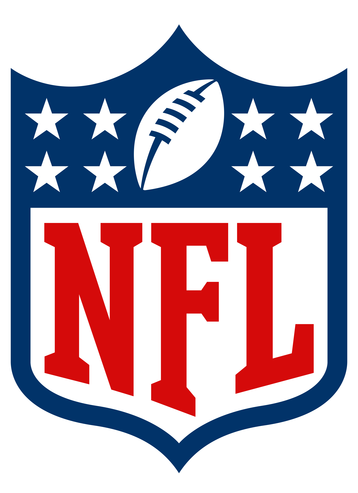

```{r setup, include=FALSE}
knitr::opts_chunk$set(echo = TRUE)
```

<!-- {width="30%", fig.align="right"} -->


```{r echo=FALSE, out.width = "30%", fig.align = "center"}
# #Add the csu logo to the document to the right of the contents
# knitr::include_graphics("img/rmarkdown_hex.png")
```


```{r echo=FALSE, out.width = "30%", fig.align = "left"}

```

```{r echo=FALSE, out.width = "30%", fig.align = "right"}

```

```{r}
library(gridExtra)
library(ggplot2)
library(png)
# Load the images into two plots
csu_logo <- grid::rasterGrob(png::readPNG("graphs/Images for paper/csu-logo.png"), interpolate = TRUE)
nfl_logo <- grid::rasterGrob(png::readPNG("graphs/Images for paper/nfl-logo.png"), interpolate = TRUE)

# Combine the two images side by side
grid.arrange(
  gridExtra::arrangeGrob(csu_logo, nfl_logo, ncol = 2),
  ncol = 1
)
```


# Contents:

  1. Overview/ Introduction
  2. Description of Data Sets
  2. Exploratory Data Analysis
  3. Variables and Data Cleaning
  4. Model Selection
  5. Model Evaluation Metrics
  6. Results- Logistic Regression
  7. Results- Linear Support Vector Machine
  8. Results- Random Forrest
  9. Model Comparison
  10. Conclusion
  11. Discussion and Future Research


  
# 1. Overview/ Introduction:

  For our project we decided to participate in the National Football League's Big Data Bowl competition for 2025. The purpose of this competition is to use player and team behavior right before the play begins to gain insight into the resulting play. We realized that the most important information a defense can have is whether the offense intends to execute a run or pass play. Knowing this information would allow the defensive team to move their players around to optimize their chances of getting a tackle or otherwise disrupting the play. We therefore decided to develop statistical models that can predict what kind of play the offense will execute based on game characteristics, team characteristics, and player behavior before and during the snap which we will explore in greater detail later on. 
