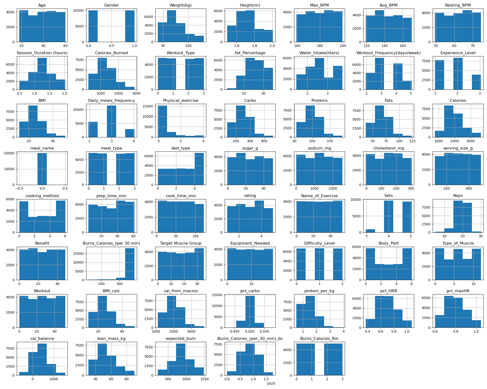

\colorlet{shadecolor}{gray!10}
```{r setup, include=FALSE}
knitr::opts_chunk$set(echo = TRUE)
library(tidyverse)
library(caret)
library(mgcv)
library(tidymodels)
library(GGally)
library(ggplot2)
library(gratia)
```
\newcommand{\hstart}{ \colorlet{shadecolor}{green!20}
\begin{shaded} }
\newcommand{\hstop}{  \end{shaded} \colorlet{shadecolor}{gray!10}}

\newcommand{\pstart}{ \colorlet{shadecolor}{gray!20}
\begin{shaded} }
\newcommand{\pstop}{  \end{shaded} \colorlet{shadecolor}{gray!10}}

\hstart

# Dataset

\hstop

\pstart

We used the *Life Style Data* dataset published on Kaggle by Omar Essa. This dataset contains approximately 20,000 observations across 54 variables, providing sufficient variablity and complexity for a machine learning research project. We deliberately selected a dataset that would require some cleaning on our parts in order to engage with the entire data science and modeling pipeline, from exploratory visualization and data cleaning through feature selection and predictive modeling.

An additional motivation for selecting this dataset was its natural structure. The variables can be divided into two distinct feature groups, diet related variables and exercise related variables which  would allow us to work with the data and run models on different parts for comparison. We were even able to choose our response variable as there were a couple different versions of calorie burn so the one we chose as the response for this project was "calorie burn in 30 minutes". Being able to divide the predictors into two groups allowed us to compare the predictive contributions of diet features, exercise features, and the combination of the two.

Key exercise-related predictors include session duration, heart rate (BPM) metrics, repetitions, sets, workout type, and experience level. Important diet-related predictors include carbohydrate, protein, fat, sugar, and sodium intake, as well as diet type and meal type. The dataset contains a mix of numerical and categorical variables, requiring appropriate preprocessing and encoding before modeling.

\pstop

\hstart

# Data Preparation

\hstop

\pstart

We began the data preparation process with exploratory data analysis to understand the structure, scale, and behavior of the variables. We performed this using both Python and R, leveraging the complementary strengths of each environment as they bring different talents to the table. We examined the data through ranges, distributions and summary statistics with particular attention to variables we felt would play a meaningful role in predicting calorie burn.

To assess relationships within the data, we created several visualizations, including histograms and correlation plots. A primary histogram displayed multiple key variables side by side, allowing us to compare their distributions and identify skewness, outliers, and differences in scale. 

\pstop

{fig-align="center"}

\pstart

In addition, a correlation plot provided insight into linear relationships among predictors as well as their associations with the response variable, calories burned in 30 minutes.

\pstop

```{=latex}
\begin{center}
\includegraphics[width=0.3\textwidth]{corrMatrix.png}
\hspace{0.5cm}
\includegraphics[width=0.3\textwidth]{corrMatrix copy.png}
\end{center}
```

\pstart

The variables that stood out after running the correlation plot:

\pstop

| Feature | Correlation with Burns_Calories_per_30_min |
|----|----|
| Burns_Calories_per_30_min | 1.000 |
| Sets | 0.465 |
| Reps | 0.343 |
| lean_mass_kg | 0.098 |
| Weight_kg | 0.091 |
| Height_m | 0.065 |
| BMI | 0.063 |
| Fat_Percentage | 0.054 |
| Experience_Level | 0.052 |
| Workout_Frequency_days_per_week | 0.044 |
| Resting_BPM | 0.038 |
| Water_Intake_liters | 0.026 |
| Workout_Pull.ups | 0.014 |
| Difficulty_Level_Beginner | 0.012 |
| Workout_Crunches | 0.011 |

\pstart

Based on these exploratory analyses, we removed variables that appeared redundant or not directly relevant to the research question. We also converted data types as needed and encoded categorical variables to ensure compatibility with the modeling techniques under consideration. Multiple versions of the cleaned dataset were saved, as different models required different data representations and preprocessing steps.

We then prepared the data for modeling by splitting the dataset into training and testing sets using an 80/20 split. The models that we applied to this dataset included multiple linear regression, tree-based methods, and generalized additive models (GAMs), followed by cross-validation to assess out-of-sample performance.

Our motivation was to predict calorie burn based on a 30 minute workout session using progressively more flexible models that would allow us to compare predictive accuracy.

\pstop

\hstart

# Research Question

\hstop

\pstart

What determines Calorie Burn? Do diet-related variables improve predictive performance beyond exercise variables alone?

\hstop

\hstart

# Motivation

\hstop

\pstart

The goal of this project was to evaluate how well different classes of predictors and models can explain and predict calorie burn during a 30 minute workout session. In particular, we investigated whether diet related variables provide meaningful predictive information beyond exercise related features, and how model performance changes as we move from simple, interpretable models to more flexible machine learning approaches. To assess generalization and guard against overfitting, we compared models using 10-fold cross validation.

\pstop

```{r}
data <- read.csv("Data/new/data.csv")
```

\hstart

# Linear Regression

\hstop

\pstart

---------- fill in --------

\pstop

\hstart

# Generalized Additive Model (GAM)

\hstop

\hstart

## Exercise Model (GAM)

\hstop

\pstart

This model explains a substantial proportion of the variability in calories burned $(84\%)$, indicating that session duration, resting beats per minute, experience level, and workout type are important predictors.

\pstop

```{r}

exercise_gam <- mgcv::gam(
  calories_burned ~ 
    s(session_duration) +
    s(resting_bpm) +
    s(max_bpm) +
    experience_level +
    workout_type,
  data = data,
  method = "GCV.Cp"
)

summary(exercise_gam)
plot(exercise_gam, pages = 1)

```

\hstart

## Smooth Terms form GAM

\hstop

\pstart

As expected, session duration has a strong, nearly linear positive effect on calories burned. Longer sessions consistently result in more calories burned, showing a positive relationship.

Resting BPM shows a moderate positive relationship with calories burned. As resting BPM increases, calories burned also tend to increase, though the effect is less pronounced than for session duration.

Maximum BPM demonstrates a complex non-linear effect with fluctuations across its range.

These patterns highlight the importance of considering non-linear relationships in understanding how phsiological and workout factors influence calories burned.

\pstop

```{r}
draw(exercise_gam) 
```

\hstart

## Exercise & Diet Model (GAM)

\hstop

\pstart

Including diet type in the model reveals a statistically significant but very small positive effect on calories burned. However, the overall model fit remains unchanged, suggesting that diet type does not substantially improve the model's ability to explain variability in calories burned beyond session duration, heart rate measures, experience level, and workout type.

\pstop

```{r}
combined_gam2 <- mgcv::gam(
  calories_burned ~ 
    s(session_duration) + 
    s(avg_bpm) + 
    s(max_bpm) + 
    s(resting_bpm) + 
    s(weight) + 
    s(age) + 
    s(bmi) + 
    experience_level + 
    workout_type +
    s(water_intake) + 
    s(workout_frequency) + 
    daily_meals_frequency +
    s(carbs) + 
    s(proteins) + 
    s(fats) +
    diet_type,
  data = data,
  method = "REML"
)

summary(combined_gam2)
plot(combined_gam2, pages = 1, se = TRUE)
```

```{r}
draw(combined_gam2) 
```

\hstart

# Classification Tree / Random Forest

\hstop

\pstart

The single decision tree with CP of .01lead to RMSE of 23.670 and explains 41.298% of variance explained, which by itself is not too useful.

//Add model parameters from .fit

//Add graphs here

When the tree are made into a random forest of 500 trees the RMSE drops to 9.844 and explains 89.847% of the variance in the data.

//add dendragram here

\pstop

\hstart

# Cross Validation

\hstop

\pstart

--------------- fill in -----------

\pstop

\hstart

# Conclusion

\hstop

\pstart

----------------- fill in ---------------

\pstop

\hstart

# References

\hstop

\pstart

Essa, Omar. (n.d.) *Life Style Data* [Data set]. Available from Kaggle, Website: https://www.kaggle.com/datasets/jockeroika/life-style-data

\pstop

