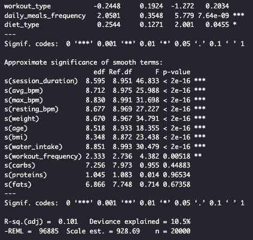
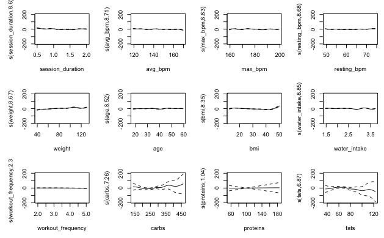
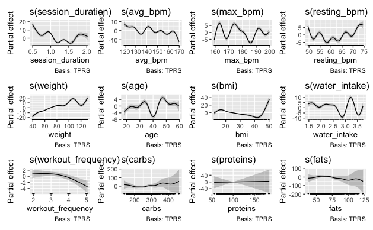
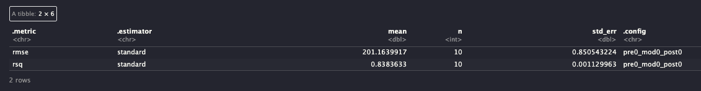
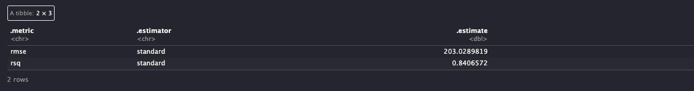
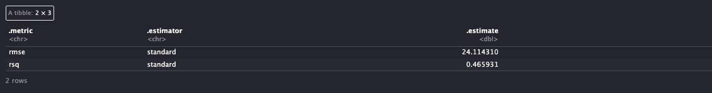

\colorlet{shadecolor}{gray!10}
```{r setup, include=FALSE}
knitr::opts_chunk$set(echo = TRUE)
library(tidyverse)
library(caret)
library(mgcv)
library(tidymodels)
library(GGally)
library(ggplot2)
library(gratia)
```
\newcommand{\hstart}{ \colorlet{shadecolor}{green!20}
\begin{shaded} }
\newcommand{\hstop}{  \end{shaded} \colorlet{shadecolor}{gray!10}}

\newcommand{\pstart}{ \colorlet{shadecolor}{gray!20}
\begin{shaded} }
\newcommand{\pstop}{  \end{shaded} \colorlet{shadecolor}{gray!10}}

\hstart

# Dataset

\hstop

\pstart

We used the *Life Style Data* dataset published on Kaggle by Omar Essa. This dataset contains approximately 20,000 observations across 54 variables, providing sufficient variablity and complexity for a machine learning research project. We deliberately selected a dataset that would require some cleaning on our parts in order to engage with the entire data science and modeling pipeline, from exploratory visualization and data cleaning through feature selection and predictive modeling.

An additional motivation for selecting this dataset was its natural structure. The variables can be divided into two distinct feature groups, diet related variables and exercise related variables which  would allow us to work with the data and run models on different parts for comparison. We were even able to choose our response variable as there were a couple different versions of calorie burn so the one we chose as the response for this project was "calorie burn in 30 minutes". Being able to divide the predictors into two groups allowed us to compare the predictive contributions of diet features, exercise features, and the combination of the two.

Key exercise-related predictors include session duration, heart rate (BPM) metrics, repetitions, sets, workout type, and experience level. Important diet-related predictors include carbohydrate, protein, fat, sugar, and sodium intake, as well as diet type and meal type. The dataset contains a mix of numerical and categorical variables, requiring appropriate preprocessing and encoding before modeling.

\pstop

\hstart

# Data Preparation

\hstop

\pstart

We began the data preparation process with exploratory data analysis to understand the structure, scale, and behavior of the variables. We performed this using both Python and R, leveraging the complementary strengths of each environment as they bring different talents to the table. We examined the data through ranges, distributions and summary statistics with particular attention to variables we felt would play a meaningful role in predicting calorie burn.

To assess relationships within the data, we created several visualizations, including histograms and correlation plots. A primary histogram displayed multiple key variables side by side, allowing us to compare their distributions and identify skewness, outliers, and differences in scale. 

\pstop

{fig-align="center"}

\pstart

In addition, a correlation plot provided insight into linear relationships among predictors as well as their associations with the response variable, calories burned in 30 minutes.

\pstop

```{=latex}
\begin{center}
\includegraphics[width=0.3\textwidth]{img/corrMatrix.png}
\hspace{0.5cm}
\includegraphics[width=0.3\textwidth]{img/corrMatrix copy.png}
\end{center}
```

\pstart

The variables that stood out after running the correlation plot:

\pstop

| Feature | Correlation with Burns_Calories_per_30_min |
|----|----|
| Burns_Calories_per_30_min | 1.000 |
| Sets | 0.465 |
| Reps | 0.343 |
| lean_mass_kg | 0.098 |
| Weight_kg | 0.091 |
| Height_m | 0.065 |
| BMI | 0.063 |
| Fat_Percentage | 0.054 |
| Experience_Level | 0.052 |
| Workout_Frequency_days_per_week | 0.044 |
| Resting_BPM | 0.038 |
| Water_Intake_liters | 0.026 |
| Workout_Pull.ups | 0.014 |
| Difficulty_Level_Beginner | 0.012 |
| Workout_Crunches | 0.011 |

\pstart

Based on these exploratory analyses, we removed variables that appeared redundant or not directly relevant to the research question. We also converted data types as needed and encoded categorical variables to ensure compatibility with the modeling techniques under consideration. Multiple versions of the cleaned dataset were saved, as different models required different data representations and preprocessing steps.

We then prepared the data for modeling by splitting the dataset into training and testing sets using an 80/20 split. The models that we applied to this dataset included multiple linear regression, tree-based methods, and generalized additive models (GAMs), followed by cross-validation to assess out-of-sample performance.

Our motivation was to predict calorie burn based on a 30 minute workout session using progressively more flexible models that would allow us to compare predictive accuracy.

\pstop

\hstart

# Research Question

\hstop

\pstart

What determines Calorie Burn? Do diet-related variables improve predictive performance beyond exercise variables alone?

\hstop

\hstart

# Motivation

\hstop

\pstart

The goal of this project was to evaluate how well different classes of predictors and models can explain and predict calorie burn during a 30 minute workout session. In particular, we investigated whether diet related variables provide meaningful predictive information beyond exercise related features, and how model performance changes as we move from simple, interpretable models to more flexible machine learning approaches. To assess generalization and guard against overfitting, we compared models using 10-fold cross validation.

\pstop

```{r}
data <- read.csv("Data/new/data.csv")
```

\hstart

# Linear Regression

\hstop

\pstart

---------- fill in --------

\pstop

```{r linear data}
life <- read.csv("Data/clean/life_clean.csv")

# dropping the index column and mutating
life <- life %>%
  dplyr::select(-X) %>%
  dplyr::mutate(across(where(is.character), as.factor))

exer <- c("session_duration_hours", "max_bpm", "avg_bpm", "resting_bpm", "workout_frequency_days_week", "experience_level", "sets", "reps", "workout_type", "difficulty_level", "workout", "target_muscle_group", "body_part", "type_of_muscle")

diet <- c("carbs", "proteins", "fats", "calories", "sugar_g", "sodium_mg", "cholesterol_mg", "meal_type", "diet_type", "daily_meals_frequency", "serving_size_g", "cooking_method", "prep_time_min", "cook_time_min", "pct_carbs", "protein_per_kg", "cal_from_macros", "cal_balance")

combined <- union(exer, diet)

setdiff(exer, names(life))
setdiff(diet, names(life))

```

```{r linear modeling}
# modeling
make_formula <- function(y, xs) {
  as.formula(paste(y, "~", paste(xs, collapse = " + ")))
}

f_exer <- make_formula("burns_calories_per_30min", exer)
f_diet <- make_formula("burns_calories_per_30min", diet)
f_combined <- make_formula("burns_calories_per_30min", combined)

lm_exer <- lm(f_exer, data = life)
lm_diet <- lm(f_diet, data = life)
lm_combined <- lm(f_combined, data = life)

```

```{r glancing}

broom::glance(lm_exer)
broom::glance(lm_diet)
broom::glance(lm_combined)

```

```{r combining linear}
# combine model stats

model_list <- list(
  exercise = lm_exer,
  diet = lm_diet,
  combined = lm_combined
)

library(broom)
library(dplyr)
library(purrr)

model_comp <- model_list %>%
  imap_dfr(~ glance(.x) %>% mutate(model = .y),.id = NULL) %>%
  dplyr::select(model, r.squared, adj.r.squared, sigma,          # residual std error 
                statistic,      # F-statistic 
                p.value,        # global F-test p-value
                AIC, BIC) %>%
  arrange(desc(adj.r.squared))

model_comp

```

```{r rmse}
rmse <- function(mod) {
  sqrt(mean(residuals(mod)^2))
}

rmse_tbl <- model_list %>%
  imap_dfr(~ tibble(
    model = .y,
    rmse  = rmse(.x)
  ))

rmse_tbl

```

```{r mergin tables}
# merging tables

model_summary <- model_comp %>%
  left_join(rmse_tbl, by = "model")

model_summary
saveRDS(model_summary, "linear_model_summary.rds")

```

# Plotting

```{r linear plotting}

plot_diagnostics <- function(model, title_prefix = "") {
  
  aug <- augment(model)
  
  p1 <- ggplot(aug, aes(.fitted, .resid)) +
    geom_point(alpha = 0.4) +
    geom_hline(yintercept = 0, linetype = "dashed") +
    labs(title = paste0(title_prefix, "Residuals vs Fitted"),
         x = "Fitted Values", y = "Residuals") +
    theme_minimal()
  
  p2 <- ggplot(aug, aes(sample = .resid)) +
    stat_qq(alpha = 0.4) +
    stat_qq_line() +
    labs(title = paste0(title_prefix, "QQ Plot of Residuals"),
         x = "Theoretical Quantiles", y = "Sample Quantiles") +
    theme_minimal()
  
  p3 <- ggplot(aug, aes(.hat, .cooksd)) +
    geom_point(alpha = 0.4) +
    labs(title = paste0(title_prefix, "Leverage vs Cook's Distance"),
         x = "Leverage (Hat Values)", y = "Cook's Distance") +
    theme_minimal()
  
  list(residuals_plot = p1, qq_plot = p2, leverage_plot = p3)
}


```

```{r linear exercise diagnostics}
# exercise diagnositic

diag_ex <- plot_diagnostics(lm_exer, "Exercise Model: ")
diag_ex$residuals_plot
diag_ex$qq_plot
diag_ex$leverage_plot

```

\hstart

# Generalized Additive Model (GAM)

\hstop

\hstart

## Exercise Model (GAM)

\hstop

\pstart

This model explains a substantial proportion of the variability in calories burned $(84\%)$, indicating that session duration, resting beats per minute, experience level, and workout type are important predictors.

\pstop

```{r}
data <- read.csv("Data/new/data.csv")
exercise_gam <- mgcv::gam(
  calories_burned ~ 
    s(session_duration) +
    s(resting_bpm) +
    s(max_bpm) +
    experience_level +
    workout_type,
  data = data,
  method = "GCV.Cp"
)

summary(exercise_gam)
plot(exercise_gam, pages = 1)
```

\hstart

## Smooth Terms form GAM Model 1

\hstop

\pstart

As expected, session duration has a strong, nearly linear positive effect on calories burned. Longer sessions consistently result in more calories burned, showing a positive relationship.

Resting BPM shows a moderate positive relationship with calories burned. As resting BPM increases, calories burned also tend to increase, though the effect is less pronounced than for session duration.

Maximum BPM demonstrates a complex non-linear effect with fluctuations across its range.

These patterns highlight the importance of considering non-linear relationships in understanding how physiological and workout factors influence calories burned.

\pstop

```{r}
draw(exercise_gam) 
```

\hstart

# Exercise Model with Calories Burned 30-minute as the Response Variable

\hstop

```{r}
data <- read.csv("Data/new/data.csv")
exercise_gam2 <- mgcv::gam(
  caloriesBurned_per30 ~ 
    s(session_duration) +
    s(resting_bpm) +
    s(max_bpm) +
    s(avg_bpm) +
    experience_level +
    expected_burn +
    pct_maxhr +
    workout_frequency +
    workout_type,
  data = data,
  method = "GCV.Cp"
)

summary(exercise_gam2)
plot(exercise_gam2, pages = 1)
```

\hstart

## Smooth Terms form GAM Model 2

\hstop

\pstart

The second model extends the initial GAM by modeling calories burned per 30 minutes rather than total calories, and by incorporating additional variables. This allows for more standardized and interpretable outcome across workouts of different lengths. 

Model 2 shows a substantial improvement in explanatory power compared to Model 1. The adjusted $R^2$ increases from 0.84 to 0.96,  and deviance explained rises from $84\%$ to $96.4\%$, indicating that the additional predictors are refined response variables capture much more of the variability in caloric expenditure. The lower GCV score also suggests a better model fit.

While Model 1 effectively captures total caloric expenditure driven largely by session duration, Model 2 provides a more detailed and physiologically meaningful explanation of calorie burn rate. The inclusion of average heart rate, expected burn, and intensity measures allows the model to uncover complex non-linear patterns and delivers a stronger fit. Overall, Model 2 offers a stronger and more interpretable framework for understanding how fitness, intenstiy, and cardiovascular response shape caloric efficiency during workouts.

\pstop

\hstart

# Exercise & Diet Model 

\hstop

\pstart

Including diet type in the model yields a statistically significant but very small positive effect on calories burned per 30 minutes.

Despite this significance, overall model fit remains unchanged, indicating that diet type contributes minimal additional explanatory power beyond established predictors such as session duration, heart rate measures, experience level, and workout characteristics. 

A separate comparison model using total calories burned was also evaluated; however, because the results were identical, it was not included.

\pstop

```{r, eval=FALSE}
combined_gam3 <- mgcv::gam(
  caloriesBurned_per30 ~ 
    s(session_duration) + 
    s(avg_bpm) + 
    s(max_bpm) + 
    s(resting_bpm) + 
    s(weight) + 
    s(age) + 
    s(bmi) + 
    experience_level + 
    workout_type +
    s(water_intake) + 
    s(workout_frequency) + 
    daily_meals_frequency +
    s(carbs) + 
    s(proteins) + 
    s(fats) +
    diet_type,
  data = data,
  method = "REML"
)


summary(combined_gam3)
```

{fig-align="center"}

```{r, eval=FALSE}
plot(combined_gam3, pages = 1, se = TRUE)
```

{fig-align="center"}

```{r, eval=FALSE}
draw(combined_gam3) 
```

{fig-align="center"}

\hstart

# Regression Tree / Random Forest

\hstop

\pstart

I used tree-based regression to model **Calories Burned per 30 Minutes** against demographic and physiological predictors. These methods are well suited for fitness data, where relationships between variables are often nonlinear and involve interactions that are difficult to specify in advance.

\pstop

\hstart

### Regression Tree

\hstop

\pstart

I fit a regression tree using the `rpart` package, treating **Burns_Calories_per_30_min** as the response variable. The algorithm partitioned the predictor space into disjoint regions by recursively selecting splits that minimized within-node variance. I controlled model complexity by setting a complexity parameter of **cp = 0.01** and a minimum split size of **minsplit = 20**. These constraints prevented the tree from overfitting and ensured that each split represented a meaningful number of observations.

\pstop

```{r warning=FALSE, message=FALSE}
library(rpart)
library(randomForest)
library(rpart.plot)
data_factor <- read.csv("./Data/clean/CleanLifeDataFactor.csv")

n <- nrow(data_factor)
train_idx <- sample(seq_len(n), size = 0.8 * n)

train <- data_factor[train_idx, ]
test  <- data_factor[-train_idx, ]
target <- "Burns_Calories_per_30_min"

tree_model <- rpart(
  Burns_Calories_per_30_min ~ .,
  data   = train,
  method = "anova",   # regression tree
  control = rpart.control(
    cp = 0.01,        # complexity parameter
    minsplit = 20
  )
)

rpart.plot(tree_model,cex = .5)
```

\pstart

The regression tree also allowed me to calculate feature importance scores, I primarily used these importance scores as a diagnostic tool rather than as a basis for causal interpretation. These rankings identify which physiological variables contribute most to predictive accuracy.

\pstop

```{r}
sort(tree_model$variable.importance, decreasing = TRUE)
```

\pstart

The resulting tree structure showed that workout intensity and body composition dominate the primary nodes. These upper-level splits indicate that these factors exert the strongest influence on total calorie expenditure. Furthermore, the hierarchical branches reveal clear interaction effects; for instance, the impact of age on calorie burn changes significantly depending on the individual's heart rate. While this rule-based structure provides excellent interpretability, its greedy splitting mechanism makes it sensitive to minor fluctuations in the training data.

\pstop

\hstart

### Random Forest

\hstop

\pstart

To stabilize these predictions, I implemented a random forest via the `randomForest` package. This ensemble approach constructs multiple decision trees using bootstrap samples and a random subset of predictors at each split. By averaging the results across the entire forest, the model reduces the high variance typical of a single tree while maintaining the ability to capture complex data patterns.

\pstop

```{r, echo=FALSE}
p <- ncol(train) - 1

set.seed(123)
rf_model <- readRDS("Data/models/random_forest_model.rds")

#rf_model <- randomForest(
#  Burns_Calories_per_30_min ~ .,
#  data  = train,
#  ntree = 500,
#  mtry  = floor(sqrt(p)),
#  importance = TRUE
#)
#saveRDS(rf_model, file = "Data/models/random_forest_model.rds")

rf_model

#cat("\\begingroup\\scriptsize\n")
#cat("\\begin{verbatim}\n")
#print(summary(rf_model))
#cat("\\end{verbatim}\n")
#cat("\\endgroup\n")


```

\pstart

Ultimately, the random forest provides a much more robust framework for predicting calorie burn across diverse exercise conditions, even if it sacrifices the immediate visual simplicity of a single tree.

\pstop

\hstart

# Cross Validation

\hstop

\pstart

We performed 10-fold cross validation on all models, including the GAM model, the linear model, and the regression tree. We ran the cross validation with a training and testing split of 0.8 and 0.2. 10 was our chosen number of folds after running each model with 5, 10, and 15 folds. Increasing and decreasing the number of folds did not demonstrate much change in the testing error. Although we performed cross validation on each of the models including diet, exercise, and both exercise and diet, there was little difference in the testing errors. Below is the output for the linear model cross validation with just the predictors for exercise. 

\pstop

```{r}
set.seed(445)
data_split <- initial_split(data, prop = 0.8)
data_train <- training(data_split)
data_test <- testing(data_split)

gam_cv_10fold <- vfold_cv(data_train, v = 10)
```

```{r, eval=FALSE}
# exercise
linear_spec <- linear_reg() |>
  set_engine("lm") |>
  set_mode("regression")

lin_formula_exercise <- calories_burned ~
    session_duration +
    resting_bpm +
    max_bpm +
    experience_level +
    workout_type

exercise_lin_rec <- recipe(calories_burned ~ ., data = data_train) |>
  step_dummy(all_nominal_predictors(), -all_outcomes())

exercise_lin_wf <- workflow() |>
  add_model(linear_spec, formula = lin_formula_exercise) |>
  add_recipe(exercise_lin_rec)

exercise_lin_fit <- exercise_lin_wf |>
  fit_resamples(resamples = gam_cv_10fold, 
                metrics = yardstick::metric_set(yardstick::rmse, yardstick::rsq))
```

```{r, eval=FALSE}
collect_metrics(exercise_lin_fit)
```

{fig-align="center"}

\pstart

From the metrics, we see the RMSE is 201 and $R^2$ is 0.83. While performing cross validation on the linear model improved the amount of variability explained by the model, it significantly increased the RMSE. So, while our model improves for interpretability, it worsens for prediction. Since our goal is to predict, the original linear model would perform better at prediction. 

Moving on to the GAM model, we see little change between the GAM model before and after cross validation. Below is the output. 

\pstop

```{r, eval=FALSE}
gam_spec <- gen_additive_mod(select_features = tune("alpha")) |>
  set_engine("mgcv") |>
  set_mode("regression")

gam_formula <- calories_burned ~ 
    s(session_duration) +
    s(resting_bpm) +
    s(max_bpm) +
    experience_level +
    workout_type

exercise_gam_rec <- recipe(calories_burned ~ ., data = data_train) |>
  step_dummy(all_nominal_predictors())

exercise_gam_wf <- workflow() |>
  add_model(gam_spec, formula = gam_formula) |>
  add_recipe(exercise_gam_rec)

tune_data <- data.frame(alpha = 10^seq(-3, -1, length.out = 10))

exercise_gam_fit <- exercise_gam_wf |>
  tune_grid(resamples = gam_cv_10fold, grid = tune_data,
            metrics = yardstick::metric_set(yardstick::rmse, yardstick::rsq))

exercise_gam_final <- finalize_workflow(exercise_gam_wf, 
                                        select_best(exercise_gam_fit, metric = "rmse"))
exercise_gam_final |>
  fit(data = data_train) -> exercise_gam_final_fit

exercise_gam_final_fit |>
  augment(new_data = data_test) -> pred

metrics <- pred |>
  yardstick::metric_set(yardstick::rmse, yardstick::rsq)(
    truth = calories_burned,
    estimate = .pred)

metrics
```

{fig-align="center"}

\pstart

Running cross validation on the GAM model does not show much improvement. The RMSE is 203 and $R^2$ remains at 0.84. Similarly to the linear regression model, the GAM model would not perform well at prediction. 

Here is the tree cross validation.

\pstop

```{r, eval=FALSE}
# CV on tree model
set.seed(445)
train_cv_10fold <- vfold_cv(train, v = 10)

tree_tune_spec <- decision_tree(cost_complexity = tune("alpha")) |>
  set_engine("rpart") |>
  set_mode("regression")

tree_tune_rec <- recipe(Burns_Calories_per_30_min ~ ., data = train)

tree_wf <- workflow() |>
  add_model(tree_tune_spec) |>
  add_recipe(tree_tune_rec)

# tune_data <- data.frame(alpha = 10^seq(-3, -1, length.out = 10))

tune_fit <- tree_wf |>
  tune_grid(resamples = train_cv_10fold, grid = tune_data, 
            metrics = yardstick::metric_set(yardstick::rmse))

tree_final <- finalize_workflow(tree_wf, select_best(tune_fit, metric = "rmse"))
tree_final |>
  fit(data = train) -> tree_final_fit

tree_final_fit |>
  augment(new_data = test) -> pred

metrics <- pred |>
  yardstick::metric_set(yardstick::rmse, yardstick::rsq)(
    truth = Burns_Calories_per_30_min,
    estimate = .pred)

metrics
```

{fig-align="center"}

\pstart

We see that cross validation performed the best on the tree model. $R^2$ increased to 0.78 and RMSE remained low at 14. However, applying a random forest to the tree improved the model even further. While cross validation performed worse than the random forest, we can see that the model lends itself well to models that are not linear. 

\pstop

\hstart

# Conclusion

\hstop

\pstart

----------------- fill in ---------------

\pstop

\hstart

# References

\hstop

\pstart

Essa, Omar. (n.d.) *Life Style Data* [Data set]. Available from Kaggle, Website: https://www.kaggle.com/datasets/jockeroika/life-style-data

\pstop

