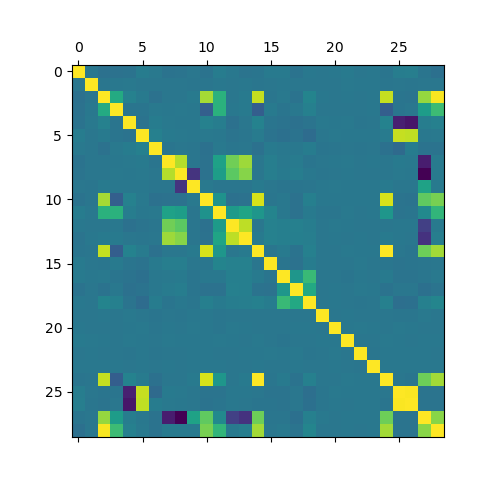

```{r setup, include=FALSE}
knitr::opts_chunk$set(echo = TRUE)
#libraries
library(tidyverse)
library(caret)
library(mgcv)
library(tidymodels)
library(GGally)
library(ggplot2)
library(gratia)
```

```{r}
data <- read.csv("~/project-2/Data/new/data.csv")
```

## Question/Problem

What features in our data have significant effects on calorie burns per 30 min, and does diet impact the calorie count during exercise?

## Data Preparation

The data required some preparation to make it read to be fit to a model. we started by determining the features that have the largest impact on the amount of calories burned. We started by making a correlation matrix to get an idea for what features are significant.

{width="30%"} {width="30%"}

Here is a peak at the variable that correlated the most.

| Feature | Correlation with Burns_Calories_per_30_min |
|----|----|
| Burns_Calories_per_30_min | 1.000 |
| Sets | 0.465 |
| Reps | 0.343 |
| lean_mass_kg | 0.098 |
| Weight_kg | 0.091 |
| Height_m | 0.065 |
| BMI | 0.063 |
| Fat_Percentage | 0.054 |
| Experience_Level | 0.052 |
| Workout_Frequency_days_per_week | 0.044 |
| Resting_BPM | 0.038 |
| Water_Intake_liters | 0.026 |
| Workout_Pull.ups | 0.014 |
| Difficulty_Level_Beginner | 0.012 |
| Workout_Crunches | 0.011 |

## Generalized Additive Model (GAM)

# Exercise Model with Calories Burned as the Response Variable

This model explains a substantial proportion of the variability in calories burned $(84\%)$, indicating that session duration, resting beats per minute, experience level, and workout type are important predictors.

```{r}
data <- read.csv("~/project-2/Data/new/data.csv")
exercise_gam <- mgcv::gam(
  calories_burned ~ 
    s(session_duration) +
    s(resting_bpm) +
    s(max_bpm) +
    experience_level +
    workout_type,
  data = data,
  method = "GCV.Cp"
)

summary(exercise_gam)
plot(exercise_gam, pages = 1)

```
## Smooth Terms form GAM Model 1

As expected, session duration has a strong, nearly linear positive effect on calories burned. Longer sessions consistently result in more calories burned, showing a positive relationship.

Resting BPM shows a moderate positive relationship with calories burned. As resting BPM increases, calories burned also tend to increase, though the effect is less pronounced than for session duration.

Maximum BPM demonstrates a complex non-linear effect with fluctuations across its range.

These patterns highlight the importance of considering non-linear relationships in understanding how phsiological and workout factors influence calories burned.

## Exercise Model with Calories Burned 30-minute as the Response Variable

```{r}
data <- read.csv("~/project-2/Data/new/data.csv")
exercise_gam2 <- mgcv::gam(
  caloriesBurned_per30 ~ 
    s(session_duration) +
    s(resting_bpm) +
    s(max_bpm) +
    s(avg_bpm) +
    experience_level +
    expected_burn +
    pct_maxhr +
    workout_frequency +
    workout_type,
  data = data,
  method = "GCV.Cp"
)

summary(exercise_gam2)
plot(exercise_gam2, pages = 1)
```
## Comparison between GAM Model 1 & 2

The second model extends the initial GAM by modeling calories burned per 30 minutes rather than total calories, and by incorporating additional variables. This allows for more standardized and interpretable outcome across workouts of different lengths. 

Model 2 shows a substantial improvement in explanatory power compared to Model 1. The adjusted $R^2$ increases from 0.84 to 0.96,  and deviance explained rises from $84\%$ to $96.4\%$, indicating that the additional predictors are refined response variables capture much more of the variability in caloric expenditure. The lower GCV score also suggests a better model fit.

While Model 1 effectively captures total caloric expenditure driven largely by session duration, Model 2 provides a more detailed and physiologically meaningful explanation of calorie burn rate. The inclusion of average heart rate, expected burn, and intensity measures allows the model to uncover complex non-linear patterns and delivers a stronger fit. Overall, Model 2 offers a stronger and more interpretable framework for understanding how fitness, intenstiy, and cardiovascular response shape caloric efficiency during workouts.

## Exercise GAM Model 1 Variables
```{r}
draw(exercise_gam) 
```

## Exercise GAM Model 2 Variables
```{r}
draw(exercise_gam2) 
```

## Generalized Additive Model (GAM)

# Exercise & Diet Model

Including diet type in the model yields a statistically significant but very small positive effect on calories burned per 30 minutes.

Despite this significance, overall model fit remains unchanged, indicating that diet type contributes minimal additional explanatory power beyond established predictors such as session duration, heart rate measures, experience level, and workout characteristics. 

A separate comparison model using total calories burned was also evaluated; however, because the results were identical, it was not included.
```{r}
combined_gam3 <- mgcv::gam(
  caloriesBurned_per30 ~ 
    s(session_duration) + 
    s(avg_bpm) + 
    s(max_bpm) + 
    s(resting_bpm) + 
    s(weight) + 
    s(age) + 
    s(bmi) + 
    experience_level + 
    workout_type +
    s(water_intake) + 
    s(workout_frequency) + 
    daily_meals_frequency +
    s(carbs) + 
    s(proteins) + 
    s(fats) +
    diet_type,
  data = data,
  method = "REML"
)

summary(combined_gam2)
plot(combined_gam2, pages = 1, se = TRUE)
```

```{r}
draw(combined_gam2) 
```

# Classification Tree / Random Forest

The single decision tree with CP of .01lead to RMSE of 23.670 and explains 41.298% of variance explained, which by itself is not too useful.

//Add model parameters from .fit

//Add graphs here

When the tree are made into a random forest of 500 trees the RMSE drops to 9.844 and explains 89.847% of the variance in the data.

//add dendragram here


# Cross Validation

