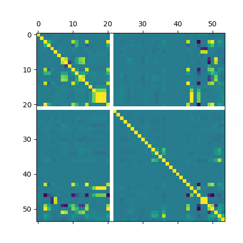

# project-2
**Group 2 Project for DSCI445 @ CSU**
**Names:**

## Data
Data from [Kaggle](https://www.kaggle.com/datasets/jockeroika/life-style-data "Life Style Data Set") *Life Style Data* by Omar Essa.  

| **Feature** | **Description** |
|--------------|-----------------|
| Age | Age of the participant (in years). |
| Gender | Biological gender (Male/Female). |
| Weight (kg) | Weight of the individual in kilograms. |
| Height (m) | Height of the individual in meters. |
| Max_BPM | Maximum heart rate recorded during a workout session. |
| Avg_BPM | Average heart rate maintained during the session. |
| Resting_BPM | Resting heart rate before starting the workout. |
| Session_Duration (hours) | Duration of the workout session in hours. |
| Calories_Burned | Total calories burned during the session. |
| Workout_Type | Type of workout performed (e.g., Strength, HIIT, Cardio). |
| Fat_Percentage | Body fat percentage of the individual. |
| Water_Intake (liters) | Average daily water consumption in liters. |
| Workout_Frequency (days/week) | Number of workout days per week. |
| Experience_Level | Fitness experience level (1=Beginner, 2=Intermediate, 3=Advanced). |
| BMI | Body Mass Index, a measure of body fat based on height and weight. |
| Daily meals frequency | Number of meals consumed daily. |
| Physical exercise | Indicates the type or frequency of physical activity. |
| Carbs | Daily carbohydrate intake (grams). |
| Proteins | Daily protein intake (grams). |
| Fats | Daily fat intake (grams). |
| Calories | Total daily calorie intake from food. |
| meal_name | Name of the meal (e.g., Breakfast, Lunch, Dinner). |
| meal_type | Type of meal (e.g., Snack, Main, Beverage). |
| diet_type | Type of diet followed (e.g., Keto, Vegan, Balanced). |
| sugar_g | Sugar content in grams per meal. |
| sodium_mg | Sodium content in milligrams per meal. |
| cholesterol_mg | Cholesterol content in milligrams per meal. |
| serving_size_g | Portion size of the meal in grams. |
| cooking_method | Cooking method used (e.g., Boiled, Fried, Grilled). |
| prep_time_min | Preparation time in minutes. |
| cook_time_min | Cooking time in minutes. |
| rating | Meal or workout rating (typically 1–5 scale). |
| is_healthy | Boolean indicator (True/False) of whether the meal/workout is healthy. |
| Name of Exercise | Name of the exercise performed. |
| Sets | Number of sets completed in the exercise. |
| Reps | Number of repetitions per set. |
| Benefit | Description of the exercise’s physical benefit. |
| Burns Calories (per 30 min) | Estimated calories burned in 30 minutes of that exercise. |
| Target Muscle Group | Main muscle group targeted by the exercise. |
| Equipment Needed | Equipment required to perform the exercise. |
| Difficulty Level | Exercise difficulty level (Beginner, Intermediate, Advanced). |
| Body Part | Primary body part involved (e.g., Arms, Legs, Chest). |
| Type of Muscle | Type of muscle engaged (e.g., Upper, Core, Grip Strength). |
| Workout | Specific workout or exercise name. |

---

## Project and analysis
**Topic:** TBD  
**Correlation matrix:**  

